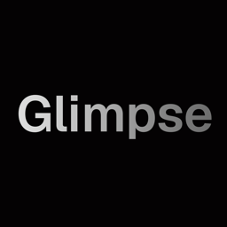
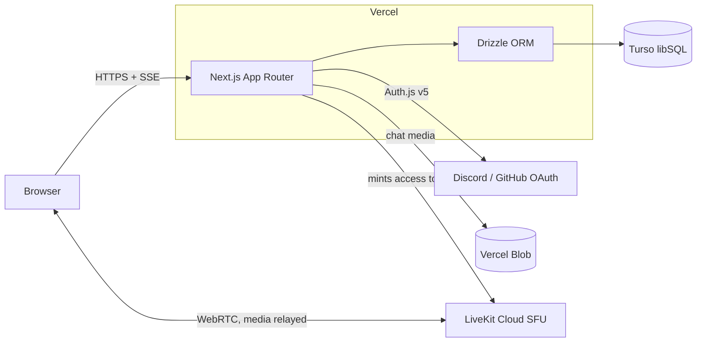
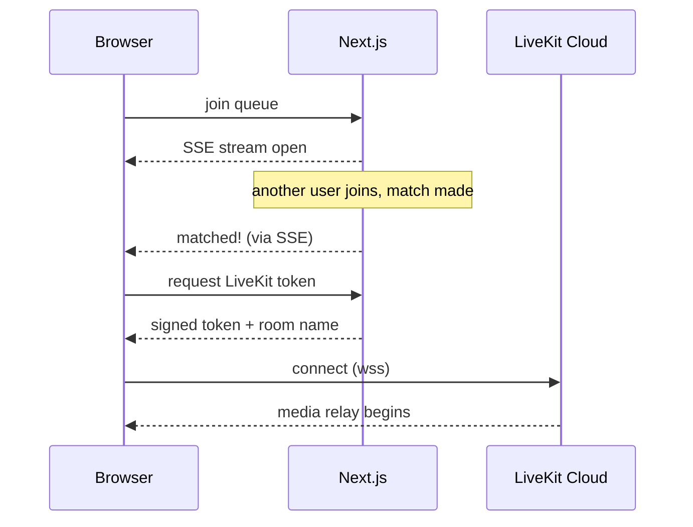

<p align="center">
  
</p>

# Glimpse

Random video chat with strangers, plus private rooms you can invite people into — with real chatrooms, custom roles, and public profiles on top. Live at [glimpse-vc.vercel.app](https://glimpse-vc.vercel.app).

## Features

- **Random matching** — hit the queue, get paired with whoever else is waiting. Match notifications arrive over SSE, no polling.
- **Private rooms** — create a room, share the link or code, talk to people you actually know.
- **Calls through an SFU** — video/audio runs through LiveKit Cloud. This replaced the old PeerJS peer-to-peer setup, which had the nasty property of exposing participants' IP addresses to each other. Media is relayed now; nobody sees anybody's IP.
- **Chatrooms with Discord-style roles** — custom roles with granular permissions: `manage_room`, `manage_roles`, `manage_members`, `manage_messages`, `invite`, `send_media`.
- **Media in chat** — images and files upload to Vercel Blob.
- **Live everything** — chat messages and queue updates stream over Server-Sent Events.
- **Public profiles** — every user gets `/u/[handle]` with a QR code and JSON-LD markup, plus sitemap/robots for search engines.
- **OAuth-only sign-in** — Discord or GitHub via Auth.js v5, JWT sessions. No passwords to leak.
- **Local-first dev** — no Turso credentials? The database falls back to a local SQLite file and everything still works.

## Architecture



Calls never go browser-to-browser. The server mints a short-lived LiveKit token, and all audio/video is relayed through the SFU — participants never learn each other's IP addresses.

The random-match flow:



## Tech stack

| Layer | What |
|---|---|
| Framework | Next.js 16.2, App Router, Turbopack |
| Auth | Auth.js v5 — Discord + GitHub OAuth, JWT sessions |
| Database | Turso (libSQL) via Drizzle ORM; local SQLite file fallback in dev |
| Calls | LiveKit Cloud SFU (`livekit-client` + `livekit-server-sdk`) |
| Chat media | Vercel Blob |
| Realtime | Server-Sent Events (chat, queue) |
| Styling | Tailwind CSS v4, Radix primitives, Framer Motion |
| Client state | Zustand (settings) |

## Local setup

```bash
git clone https://github.com/aryansrao/glimpse.git
cd glimpse
npm install
cp .env.example .env.local
# fill in the variables below
npm run dev
```

You can run with an almost-empty `.env.local`: leave the Turso variables unset and the app uses a local `glimpse-local.db` file. You will need at least one OAuth app (Discord or GitHub) and a free LiveKit Cloud project to sign in and make calls.

Useful scripts: `npm run db:push` (push schema straight to the configured DB), `npm run db:generate` (emit migration files), `npm run db:studio` (browse rows in Drizzle Studio).

## Environment variables

| Variable | Purpose |
|---|---|
| `TURSO_DATABASE_URL` | Turso database URL (`libsql://...`). Unset = local SQLite file |
| `TURSO_AUTH_TOKEN` | Turso auth token |
| `AUTH_SECRET` | Auth.js session secret — `openssl rand -base64 32` |
| `AUTH_DISCORD_ID` | Discord OAuth app client ID |
| `AUTH_DISCORD_SECRET` | Discord OAuth app client secret |
| `AUTH_GITHUB_ID` | GitHub OAuth app client ID (unset hides the GitHub button) |
| `AUTH_GITHUB_SECRET` | GitHub OAuth app client secret |
| `LIVEKIT_URL` | LiveKit project URL (server side) |
| `LIVEKIT_API_KEY` | LiveKit API key |
| `LIVEKIT_API_SECRET` | LiveKit API secret |
| `NEXT_PUBLIC_LIVEKIT_URL` | LiveKit URL the browser connects to — must be the `wss://` URL |
| `BLOB_READ_WRITE_TOKEN` | Vercel Blob token; auto-populated when you attach a Blob store on Vercel |
| `NEXT_PUBLIC_SITE_URL` | Canonical site URL, used for absolute links, sitemap, and OAuth callbacks |

OAuth redirect URIs to register: `<your-url>/api/auth/callback/discord` and `<your-url>/api/auth/callback/github`.

## Deployment

Deployed on Vercel. The build step runs Drizzle migrations against Turso automatically (`scripts/migrate.mjs` runs before `next build`), so a deploy with fresh schema changes just works — no separate migration step. Set the environment variables above in the Vercel project settings and push.
